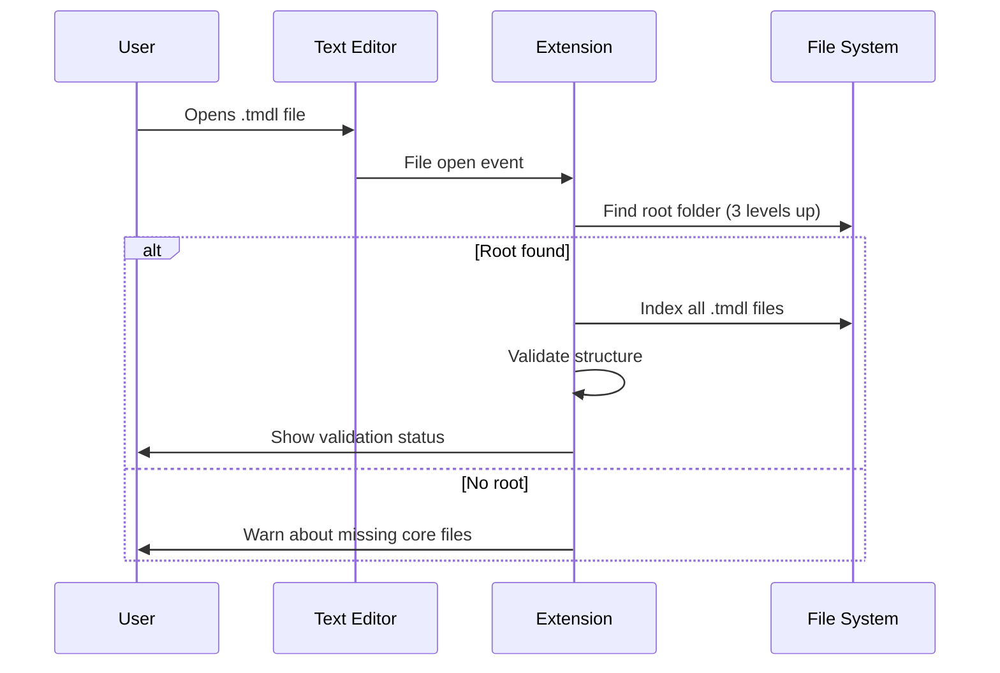

# Revised TI-FEAT-005 Implementation

## Updated Approach
1. **File System Traversal**:
```typescript
const findTmdlRoot = (currentPath: string): string | null => {
  let depth = 0;
  let currentDir = path.dirname(currentPath);
  
  while (depth < 4 && currentDir !== path.parse(currentDir).root) {
    const hasDatabase = fs.existsSync(path.join(currentDir, 'database.tmdl'));
    const hasModel = fs.existsSync(path.join(currentDir, 'model.tmdl'));
    
    if (hasDatabase && hasModel) {
      return currentDir;
    }
    
    currentDir = path.dirname(currentDir);
    depth++;
  }
  return null;
};
```

2. **File Indexing**:
```typescript
const indexTmdlFiles = (rootPath: string): string[] => {
  const tmdlFiles: string[] = [];
  
  const walk = (dir: string) => {
    const entries = fs.readdirSync(dir, { withFileTypes: true });
    for (const entry of entries) {
      const fullPath = path.join(dir, entry.name);
      if (entry.isDirectory()) {
        walk(fullPath);
      } else if (entry.isFile() && entry.name.endsWith('.tmdl')) {
        tmdlFiles.push(fullPath);
      }
    }
  };

  walk(rootPath);
  return tmdlFiles;
};
```

3. **Updated Validation Flow**:


4. **Modified Event Handler**:
```typescript
vscode.workspace.onDidOpenTextDocument(async doc => {
  if (!doc.fileName.endsWith('.tmdl')) return;

  const rootPath = findTmdlRoot(doc.fileName);
  if (!rootPath) {
    vscode.window.showWarningMessage(
      `No TMDL root folder found for ${path.basename(doc.fileName)}`
    );
    return;
  }

  const tmdlFiles = indexTmdlFiles(rootPath);
  const validationResult = validateStructure(tmdlFiles);
  showValidation(validationResult);
});
```

## Key Changes from Original Plan
- Removed project folder configuration dependency
- Added recursive directory traversal
- Implemented file system based auto-discovery
- Added file indexing functionality
- Modified validation to be file-path driven

## Testing Considerations
- Test nested folder structures
- Validate max depth enforcement
- Verify file indexing accuracy
- Test edge cases (root at different levels)
- Validate performance with large projects

Should I proceed with implementing these changes in the extension.ts file?